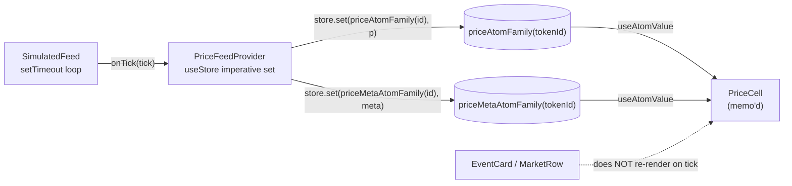

## Tutor-mode Polymarket Imitator Plan

### Ownership model

- **YOU** write anything where the learning value lives: state architecture, realtime wiring, and the React composition that proves surgical re-renders.
- **AGENT** writes the plumbing: types, API client, page shells, grids, nav chrome, Tailwind/shadcn styling, skeletons, and the README boilerplate. Agent files are ready when you open them; your files have a header comment with acceptance criteria instead of a working implementation.

### Legend

- [x] already in repo
- [A] agent will write
- [U] **you** will write (tutor-mode, with acceptance-criteria comments)

---

### Current status (Milestone 1 — Foundation)

Most of M1 is already on disk from the previous session:

- [x] `package.json` with Next 16, React 19, Jotai, React Query, framer-motion, shadcn/base-ui
- [x] [src/types/polymarket.ts](../../src/types/polymarket.ts) — `GammaEventRaw`/`GammaMarketRaw` wire types + `PolyEvent`/`Market`/`Outcome` domain types + `parseEvent`/`parseMarket` (handles the JSON-stringified `outcomes`, `outcomePrices`, `clobTokenIds`)
- [x] [src/lib/api/gamma.ts](../../src/lib/api/gamma.ts) — `fetchEvents({ limit, tagSlug, closed })` and `fetchEventBySlug(slug)` with `next: { revalidate: 30, tags: [...] }`
- [x] shadcn primitives: [badge](../../src/components/ui/badge.tsx), [button](../../src/components/ui/button.tsx), [skeleton](../../src/components/ui/skeleton.tsx), [tabs](../../src/components/ui/tabs.tsx)
- [x] Route shells: [src/app/events/[slug]](../../src/app/events), `crypto/`, `sports/`, `politics/`
- [x] Smoke-test homepage at [src/app/page.tsx](../../src/app/page.tsx) proving RSC → Gamma → parsed render works

Still to finish in M1 (small):

- [A] Update [src/app/layout.tsx](../../src/app/layout.tsx): real `<title>`/metadata, mount `<JotaiProvider>`, `<QueryClientProvider>`, and `<PriceFeedProvider>` around `{children}`.
- [A] Add `src/lib/providers.tsx` (client component) wrapping the three providers so the root layout stays a server component.

---

### Milestone 2 — Realtime + Atomic State (YOU)

Five files, all already stubbed with acceptance-criteria comments. Order matters — each builds on the previous.

1. **[U] [src/lib/realtime/priceFeed.ts](../../src/lib/realtime/priceFeed.ts)** — types only.

   ```ts
   export type PriceTick = { tokenId: string; price: number; ts: number };
   export interface PriceFeed {
     subscribe(tokenIds: string[]): void;
     unsubscribe(tokenIds: string[]): void;
     onTick(cb: (tick: PriceTick) => void): () => void;
     start(): void;
     stop(): void;
   }
   ```

2. **[U] [src/state/atoms/prices.ts](../../src/state/atoms/prices.ts)** — `priceAtomFamily(tokenId)` + `priceMetaAtomFamily(tokenId)` via `atomFamily` from `jotai/utils`. The whole architecture pivots on one atom per `tokenId`: a tick on token X re-renders only the `<PriceCell tokenId="X" />` instances.

3. **[U] [src/lib/realtime/simulatedFeed.ts](../../src/lib/realtime/simulatedFeed.ts)** — `createSimulatedFeed({ initialPrices, intervalMs })` that self-reschedules a `setTimeout` (not `setInterval`), picks one subscribed token per tick, and does a small random walk with a 10% "news spike" branch. Idempotent `start`/`stop` to survive StrictMode double-mount.

4. **[U] [src/lib/realtime/PriceFeedProvider.tsx](../../src/lib/realtime/PriceFeedProvider.tsx)** — the bridge. Uses Jotai's `useStore()` to get an imperative `store.set(...)` so the provider itself never re-renders on ticks. On mount: create feed → `subscribe(initialTokenIds)` → `start()` → register `onTick` that writes to both atom families. On unmount: unsubscribe callback + `stop()`.

5. **[U] [src/components/market/PriceCell.tsx](../../src/components/market/PriceCell.tsx)** — the money shot. `const price = useAtomValue(priceAtomFamily(tokenId))` is the entire subscription. Add a framer-motion flash keyed on `priceMetaAtomFamily(tokenId).ts`. Wrap export in `React.memo`.

**Acceptance for M2:** open React DevTools Profiler, record 5 seconds, stop — you should see only `PriceCell` instances re-rendering, nothing above them.



---

### Milestone 3 — Homepage: grid + category nav

- [U] `src/components/events/EventCard.tsx` — memo'd card. Props: `{ event: PolyEvent }`. Renders title, image/icon, volume, and a "market preview" strip: for binary markets show `<PriceCell tokenId={yesToken} />`; for multi-outcome show the top 2–3 outcomes with their `PriceCell`s. This is where you practice React composition + memoization.
- [A] `src/components/events/EventsGrid.tsx` — pure layout (responsive CSS grid), maps `events` to `EventCard`.
- [A] `src/state/atoms/filters.ts` — `selectedCategoryAtom` (primitive atom, string | null).
- [A] `src/components/nav/CategoryNav.tsx` — client component; pill buttons (All, Crypto, Sports, Politics). Writes to `selectedCategoryAtom`.
- [A] [src/app/page.tsx](../../src/app/page.tsx) — replace the smoke test. Server component that fetches `fetchEvents({ limit: 48 })` and passes to a small client wrapper that applies the `selectedCategoryAtom` filter against `event.tags[].slug` ("crypto-is-fine" for this assignment).
- [A] Initial seeding: extract every `outcome.tokenId` + `outcome.price` from the server-fetched events and pass to `<PriceFeedProvider initialPrices={...}>` so atoms have real values on first paint.

---

### Milestone 4 — Event detail page

- [A] `src/app/events/[slug]/page.tsx` — server component; `fetchEventBySlug(params.slug)`; 404 via `notFound()` when null; passes event to client tree and seeds prices.
- [U] `src/components/market/MarketRow.tsx` — memo'd row. For each `Market`, render question, outcomes list, volume, and compose `ProbabilityBar` + `PriceCell` per outcome.
- [U] `src/components/market/ProbabilityBar.tsx` — horizontal bar that reads `priceAtomFamily(tokenId)` and animates width. This is your second atomic-subscription exercise — make sure only the bar re-renders, not the row.
- [A] Event detail layout chrome: header with title + image, sticky market list, `Skeleton` loading states.

---

### Milestone 5 — Bonus category pages (Crypto + Sports)

Both bonus pages, per your scope choice.

- [A] `src/app/crypto/page.tsx` — `fetchEvents({ tagSlug: "crypto", limit: 48 })`, reuses `EventsGrid`, adds a crypto-specific header strip (inspired by Polymarket's BTC/ETH ribbon) showing top coin markets.
- [A] `src/app/sports/page.tsx` — `fetchEvents({ tagSlug: "sports", limit: 48 })`, reuses `EventsGrid`, adds a simple league-filter sub-tab (client-side) if tags allow.
- [A] `src/app/politics/page.tsx` — same pattern, lighter styling (not bonus, but trivial for parity with the nav).

---

### Milestone 6 — Polish + README

- [A] Loading skeletons for grid and detail (Suspense boundaries with `loading.tsx`).
- [A] Empty states + basic error boundaries.
- [A] Mobile responsiveness pass.
- [U] Fill in the three README `TODO` blocks in [README.md](../../README.md): Architecture (RSC vs client boundary), Realtime approach (PriceFeed interface + subscription lifecycle), Performance (profiler screenshot). Owning the writeup is part of the learning — the interview will ask about it.
- [A] Final cleanup: delete smoke-test comments, verify `npm run build` passes, ensure `npm run lint` is clean.

---

### Operating rules for tutor mode

- When we start a `[U]` task, I'll confirm the file, point you at the acceptance criteria at the top of that file, and answer targeted questions — but I won't write the code. If you're stuck for more than ~10 min, ask for a "hint level 1/2/3" and I'll escalate from nudge → pseudocode → worked example.
- When we start an `[A]` task, I'll just do it and show the diff.
- You can always flip ownership: "actually, write EventCard for me" or "let me try ProbabilityBar" — just say so.
